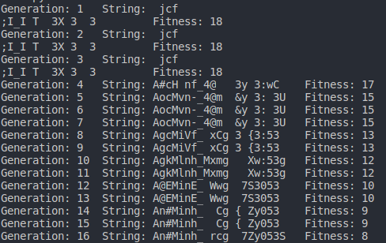
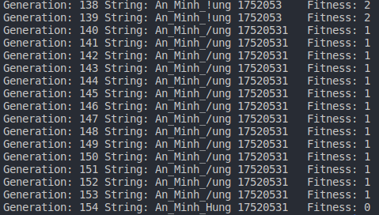

# Introduce Genetic Algorithms
1. [Introduction to Genetic Algorithms](#Introduction-to-Genetic-Algorithms)
2. [Foundation of Genetic Algorithms](#Foundation-of-Genetic-Algorithms)
3. [Demo](#Demo)
4. [Reference](#Reference)
---
### Introduction to Genetic Algorithms
[Wikipedia](https://en.wikipedia.org/wiki/Genetic_algorithm): **genetic algorithm (GA)** is a metaheuristic inspired by the process of natural selection that belongs to the larger class of evolutionary algorithms (EA). Genetic algorithms are commonly used to generate high-quality solutions to optimization and search problems by relying on biologically inspired operators such as mutation, crossover and selection.  
* **[Di truyền](https://vi.wikipedia.org/wiki/Di_truy%E1%BB%81n):** là hiện tượng chuyền đặc điểm của thế hệ trước cho thế hệ sau. rong sinh học và di truyền học, di truyền chuyển những đặc trưng sinh học từ một sinh vật cha mẹ đến con cái và nó đồng nghĩa với di chuyển gen, gen thừa nhận mang thông tin sinh học. 
* **[Tiến hóa](https://vi.wikipedia.org/wiki/Ti%E1%BA%BFn_h%C3%B3a):** sự thay đổi đặc tính di truyền của một quần thể sinh học qua những thế hệ nối tiếp nhau. Những đặc tính này là sự biểu hiện của các gen được truyền từ bố mẹ sang con cái thông qua quá trình sinh sản.  

**Thuật giải di truyền:** Là các thuật toán tìm kiếm heuristic phỏng theo quá trình thích nghi tiến hóa của quần thể với ý tưởng cơ bản là *chọn lọc tự nhiên* và *di truyền*. Nhờ vào sự trọn lọc và quan sát các đặc tính qua nhiều thế hệ qua đó tăng hiệu xuất tốt hơn trong một không gian tìm kiếm. Vì thế **GA** thường được sử dụng để tạo ra các giải pháp chất lượng cho các vấn đề tối ưu và tìm kiếm. 
 
---
### Foundation of Genetic Algorithms
**B1**: Quan sát, đánh giá sự thích nghi của các cá thể trong quần thể.  
**B2**: Chọn ngẫu nhiên các cá thể.  
**B3**: Lai tạo, chọn lọc. 
* Tạo ra các cá thể mới với đặc tính tốt nhận được từ các cá thể ban đầu.
* Loại các cá thể có đặc tính kém.  

**B4**: Sinh sản
* Giữ lại những cá thể có đặc trưng tốt.

**B5**: Xây dựng một quần thể mới.  
**B6**: Đột biến
* Thay đổi ngẫu nhiên 1 đặc trưng trong chuỗi đặc trưng của cá thể.

**B7**: Di truyền 
* Bổ sung những cá thể tốt vào quần thể mới.

**B8**: Kiểm tra xem kết quả đã tối ưu hay chưa?
* Đúng: Đưa ra kết quả.
* Sai: lặp lại bước 1.

**Note**: Vậy thì điều kiện để thuật giải di truyền đạt hiệu quả tốt thì ta phải có một không gian tìm kiếm đủ lớn để thuật toán có thể lai tạo và hội tụ.  

---
### Demo

---
### Reference
1. [Genetic Algorithms](https://www.geeksforgeeks.org/genetic-algorithms/)
2. [Genetic algorithms for modelling and optimisation](https://www.sciencedirect.com/science/article/pii/S0377042705000774)
